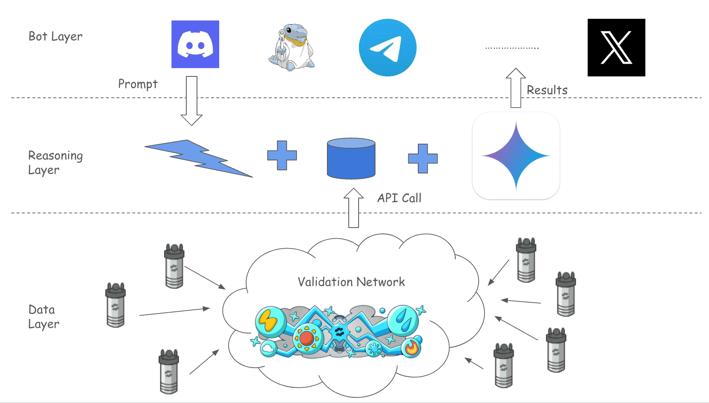

# CAILA-BOT   [](caila-arch.png)

## Overview

CAILA-BOT is a versatile bot designed to interact across multiple platforms. It leverages a robust, modular architecture for data handling and reasoning, allowing for easy extension and integration with new services. The bot processes user prompts, performs complex reasoning, and provides validated results through a multi-layered system.


## Architecture

The CAILA-BOT is structured into three distinct layers:

1.  **Bot Layer:** This is the user-facing interface, responsible for receiving prompts from various platforms such as Discord, Telegram, and others. It manages the communication flow and delivers results back to the user. Think of it as the messenger for user interactions. Currently, we are internally testing the Discord bot.

    *   **Example**:
    ```python
    def handle_discord_message(message):
      user_prompt = message.content
      response = process_prompt(user_prompt)
      message.channel.send(response)
    ```

2.  **Reasoning Layer:** The core of the bot's logic. This layer takes the prompt from the Bot Layer and processes it. It uses multiple components, including a reasoning engine, a database, and external API calls. This layer is responsible for interpreting the user intent, accessing the relevant data, and generating actions, resulting in the execution of the prompt.

    The prompt is divided into two parts:

    *   **System Prompt:** This defines the bot's fundamental behavior, acting as a template for the conversation. It is set once at the beginning of a conversation and dictates the overall context (e.g., trip planning, plant harvesting, insurance company usage).

        *   **Example System Prompt:**
            ```text
            You are a helpful trip planning assistant. Your goal is to gather the user's
            travel preferences and suggest possible itineraries. Ask specific questions
            to understand their needs. Do not make assumptions.
            ```
    *   **User Prompt:** This is the ad-hoc, present information provided by the user during the conversation. It is specific to the current interaction and is processed in the context of the ongoing conversation.

        *   **Example User Prompt:**
            ```text
            I want to go to Paris next summer for a week with my family, what do you recommend?
            ```

    *   **Reasoning Engine Example**: This is a high-level example, more details would be needed for a real implementation.
        ```python
        def process_prompt(user_prompt, system_prompt, conversation_history):
            # Parse the user intent
            intent = parse_user_intent(user_prompt)
            # Build the query
            query = build_query(intent)
            # Fetch the relevant information
            data = fetch_data(query, database)
            # Generate the response
            response = generate_response(data, system_prompt, conversation_history)
            return response
        ```

3.  **Data Layer:** The foundation of the bot. It is built around a validation network that collects and validates data from various sources to ensure reliability and accuracy. This network is decentralized, allowing for diverse inputs and robust data integrity. The data is used by the Reasoning Layer to improve responses and generate context for future prompts.

    *   **Validation Process:** The validation network uses multiple validators to ensure data is accurate. This may include methods like cross-checking sources, verifying data against known parameters, and applying statistical techniques to determine validity. It may also be a distributed process.
    *    **Data Storage**: A decentralized data storage is used to keep the data.
    *   **Data Retrieval Example:** To retrieve data, the Data Layer uses a consistent interface. Here's an example of a request and response structure when retrieving weather data:

        *   **Request (Example):**
            ```
            https://<weather endpoint that will release soon>/weather/lat=37.2144&lon=-121.8574
            ```
            This request asks for weather data based on latitude and longitude parameters.
        *   **Response (Example):**
            ```json
            {
              "data": {
                "id": "0",
                "created_at": "0001-01-01T00:00:00Z",
                "updated_at": "0001-01-01T00:00:00Z",
                "latitude": 37.2144,
                "longitude": -121.8574,
                "temperature": 9.23,
                "temperature_min": 7.57,
                "temperature_max": 10.37,
                "feels_like": 7.53,
                "pressure": 1009,
                "humidity": 57,
                "wind_speed": 3.09,
                "wind_scale": 0,
                "wind_speed_list": null,
                "wind_scale_list": null,
                "wind_direction": 0,
                "condition": "Clouds",
                "condition_desc": "broken clouds",
                "condition_code": 803,
                "condition_icon": "04n",
                "uv": 0,
                "luminance": 0,
                "elevation": 1009,
                "rain": 0,
                "wet_bulb": 0,
                "timestamp": 1737859011,
                "timezone": -28800,
                "location_name": "Cambrian Park",
                "address": "",
                "source": "o",
                "tag": "",
                "is_online": false,
                "is_malfunction": false
              },
              "ok": true
            }
            ```
           This JSON response provides detailed weather information, including temperature, humidity, wind conditions, and more. The "ok" field indicates the status of the data retrieval.

## Usage

To get started with CAILA-BOT, follow these steps:

1.  **Installation:**
    *   **Description:** Detailed instructions on how to install all the dependencies and tools needed to work with the project, including specific deployment instructions.
    *   **Documentation Location:** [Link to installation guide]
2.  **Configuration:**
    *   **Description:**  Steps to configure the necessary API keys, database connections, and other environment variables. A detailed explanation of each configuration parameter is provided to ensure smooth setup.
    *   **Documentation Location:**  [Link to configuration guide]
3.  **Basic Usage Examples:**
    *   **Description:** Provides examples of how to send initial requests to the bot across different platforms. Shows how to interpret different response formats, and provides example use cases.
    *   **Documentation Location:** [Link to usage examples guide]
        *   **Example:**
        ```python
        # Example Python Code to call the API for processing
            import requests

            url = "https://api.cailabot.com/v1/process"

            payload = {
                "user_prompt": "Can you give me some flight recommendations?",
                "system_prompt": "You are a helpful trip planning assistant.",
            }

            headers = {
                "Content-Type": "application/json",
                "Authorization": "Bearer YOUR_API_KEY"
            }

            response = requests.post(url, json=payload, headers=headers)
            print(response.json())
        ```

4.  **Contribution Guidelines:**
    *   **Description:** Clear guidelines for developers to work collaboratively on the project. It defines contribution modes, code standards, the pull request process, and how to engage in the community.
    *   **Documentation Location:** [Link to contribution guide]

## Version Control

*   This project is versioned using [Git](https://git-scm.com/) and hosted on [GitHub](https://github.com/your-repo-link)
*   [Link to the GitHub repository](https://github.com/your-repo-link)

## License

This project is licensed under the [MIT License](https://opensource.org/licenses/MIT).

## Contact

*   If you have any questions or comments, please contact the team via:
    *   Email: [contact@email.com](mailto:contact@email.com)
    *   Slack: [Link to Slack Workspace]
    *   Discord: [Link to Discord Channel]

---

**Note:** The image path `caila-arch.png` is relative to this document's location. Please ensure this path is correct or use an absolute URL if the image is hosted elsewhere.
